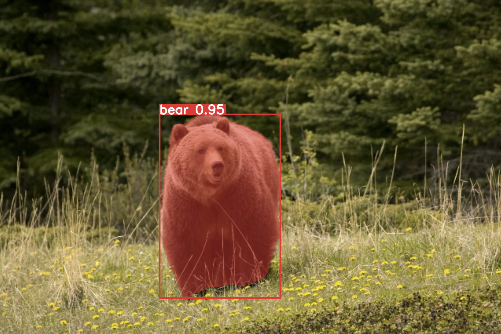
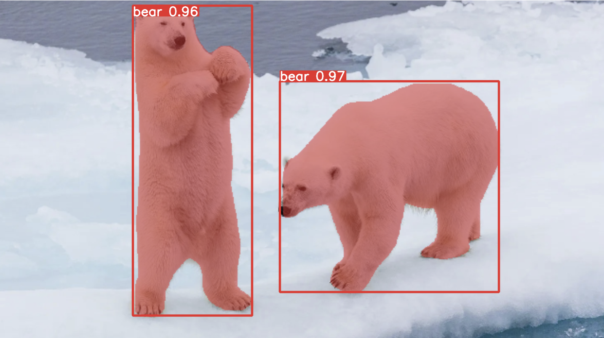

# Bear Detection & Segmentation

This repository include training detection and segmentation model in order to detect bear with the use of YoloV8.

The detection (bounding boxes) data comes from the roboflow website: https://universe.roboflow.com/school-thz5l/bear-vejfe

The segmentation data are generated (pseudo label) using [SAM](https://github.com/facebookresearch/segment-anything) model from Facebookai.

The different notebook are:

- [1-Convert_data_yolo_format.ipynb](1-Convert_data_yolo_format.ipynb) : convert coco format into yolov8 format
- [2-train_yolo_detection.ipynb]([2-train_yolo_detection.ipynb): train a yolov8 detection model
- [3-SAM-zero_shot_segmentation.ipynb](3-SAM-zero_shot_segmentation.ipynb): generate pseudo label using SAM for segmentation data
- [4-train_yolo_segmentation]([4-train_yolo_segmentation): train a segmentation model

# Examples of Detections/Segmentations

 
 

# Dataset for Detection

After downloading the dataset, unzip the file into the folder 'datasets/bear'.

> unzip Bear.v1i.coco.zip -d 'datasets/bear'

Then you can run the first notebook.

# Pseudo Label with SAM for dataset segmentation

1. clone the github repo for SAM from the facebook's github

> git clone https://github.com/facebookresearch/segment-anything.git

2. Download the checkpoint of SAM:

> cd segment-anything && wget https://dl.fbaipublicfiles.com/segment_anything/sam_vit_h_4b8939.pth 

You can then use the notebook 3-SAM-zero_shot_segmentation.ipynb

# Source

https://universe.roboflow.com/school-thz5l/bear-vejfe

https://github.com/ultralytics/ultralytics

https://github.com/facebookresearch/segment-anything