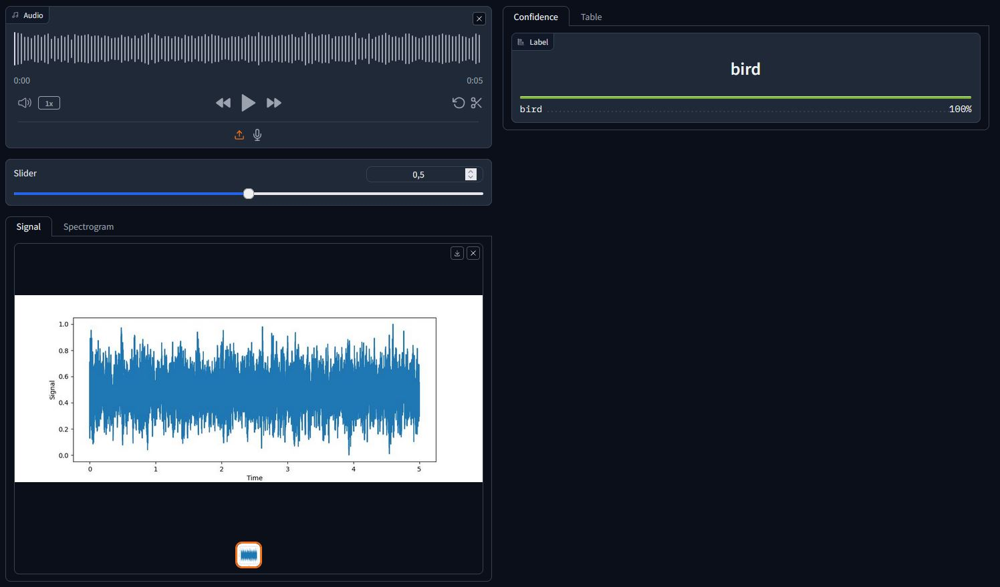
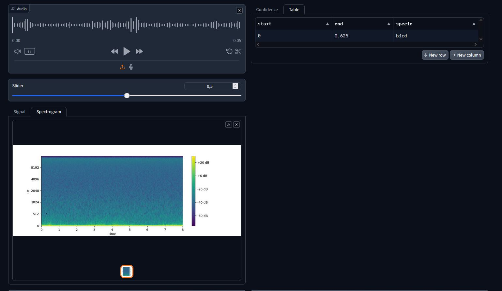

# BirdCall

This repository allows to use the [SED architecture](https://github.com/Shiro-LK/SoundEventDetection) for bird recognition using a friendly graphical user interface (GUI) using Gradio.
You can find two types of birds detections: 
- detection of birds or not (birds vs nocall)
- detection of 575 species from previous birdclef competitions. You can find the list in data/primary.json
 

Keep in mind that the detection of birds/nocall might not be accurate as the dataset was only using Birdclef dataset, therefore it does not contains sound outside this domain. (for example, there is no human voice in the training set)

# GUI Demo 

You have the option to initiate a graphical user interface (GUI) using Gradio, featuring a streamlined version employing a EfficientNet model for 5 second clip. This setup enables you to obtain predictions along with an approximative timestamps, providing insights where birds can be heard.
To use the checkpoint with AudioClassifierSequenceSED architectures, some changes need to be done in the GUI (in app.py and utils.py).

> pip install audio-sed

> cd app_gradio

> python app.py

to download the weights, 3 checkpoints can be found:

| framework  | backbone  | Architecture  | link   | species |
|---|---|---|---|---|
| pytorch   | efficientnet_b0  | AudioSED  | [here](https://drive.google.com/file/d/1ZNq2PEJTvGLBbQT01V8AySR3alNKFpvi/view?usp=sharing)  | bird/nocall |
| pytorch  | efficientnet_b2  | AudioSED  | [here](https://drive.google.com/file/d/1NnMS6njPC8g8bIGZWmfIekDaenwQRXzI/view?usp=sharing)   | 575 birds |
| pytorch |  efficientnet_b2 | AudioClassifierSequenceSED  |  [here](https://drive.google.com/file/d/1lVyjOMjl6GJ3fGG3EeFx-ZAx1y409F4p/view?usp=sharing) | 575 birds |

save them in data folder.

Examples of samples can be found [here](https://drive.google.com/drive/folders/1jMZ3qi5bOFRVvwmLfBu_qwp8mlTjHQgs?usp=sharing)
# Example of Visualisation 

# Training 

Script not available for now.

# Citation 

- (PANNs: Large-Scale Pretrained Audio Neural Networks for Audio Pattern Recognition)[https://arxiv.org/abs/1912.10211]
- PANNs model: https://github.com/qiuqiangkong/audioset_tagging_cnn
- https://github.com/Shiro-LK/SoundEventDetection