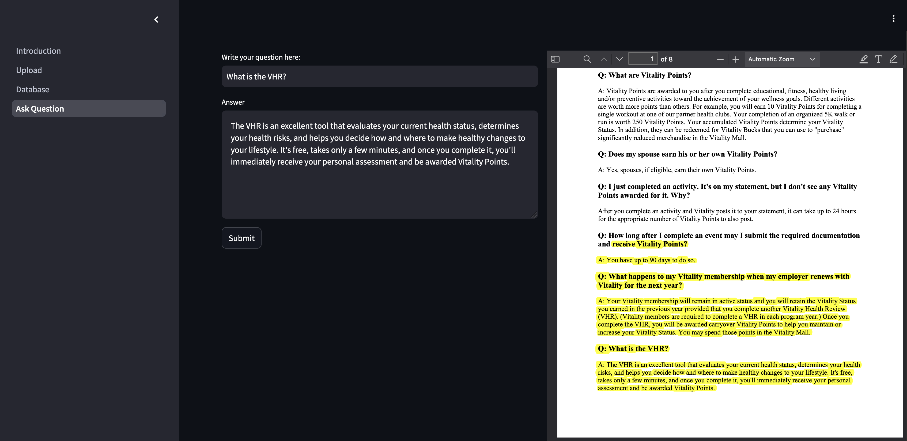

# Q&A Assistant with RAG and LLM Integration:

- Document Upload: Users can upload documents.
- Chunking and Storage: The documents are divided into manageable chunks and stored in a ChromaDB database (locally).
- Query Answering: Questions are answered using Retrieval-Augmented Generation (RAG).
- Answer Source Display: The relevant PDF section containing the answer is displayed.

*Technologies Used: Langchain, Transformers, Streamlit, FastAPI, doctr.*

Note: Llama3.1 is used, however for better performances, you can use OPENAI or CLAUDE LLMs.

# Installation

First, install huggingface and pytorch:
- transformers:4.44.0
- pytorch:1.12.1+cu116

If you want to use cpu, you should slightly change the code.

> pip install -r requirements.txt

uninstall tensorflow:

> pip uninstall tensorflow

# Example:

