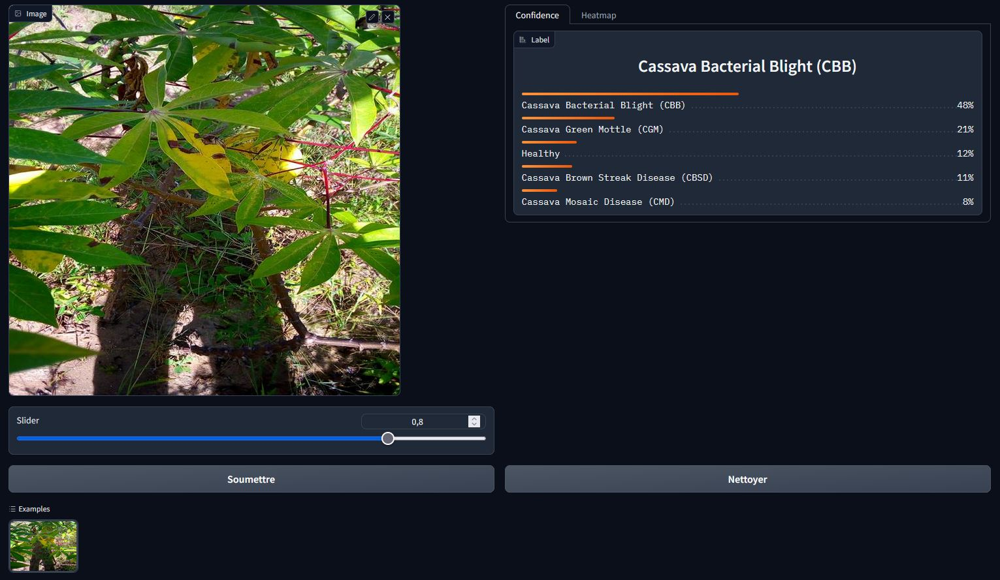
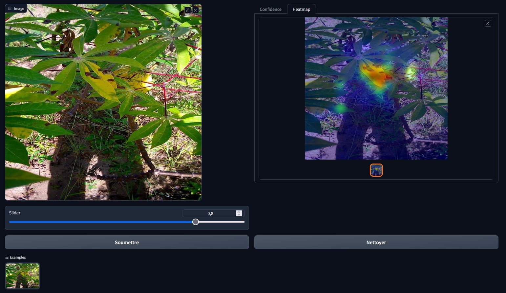

# Cassava Leaf Disease Classification

The Cassava Disease Classification competition on Kaggle focuses on classifying images of cassava leaves into one of four disease categories or determining if the leaf is healthy. Cassava is a crucial food security crop in Africa, especially for small-holder farmers. Viral diseases significantly impact yields, with 80% of such households in Sub-Saharan Africa growing cassava. This project provides an opportunity to showcase skills in image classification, machine learning, and addressing real-world agricultural challenges.

In this repo, you will find a simplified version of our solution which allow us to reach the 11th position of the competition (gold zone). The original solution was based on:
- diversity of CNN/Transformers architectures (ViT, EfficientNet, seresnext, Xception)
- diversity of input size (512x512, 600x800, 384x384)
- data augmentations (rotation, shift, cutmix, mixup, zoom in/out etc)
- TTA (flip, transpose, center crop etc) - Test Time Augmentations
- Xception was trained with a Knowledge Distillation Strategy

# GUI Demo 

You have the option to initiate a graphical user interface (GUI) using Gradio, featuring a streamlined version employing a ConvNeXt model. This setup enables you to obtain predictions along with a heatmap, providing insights into the areas the model emphasizes in making its predictions.

> cd app_gradio

> python app.py

to download the weights: click [here](https://drive.google.com/file/d/1gIMidWgLr2cPzwsQMSxRXqYO3xC3q6-S/view?usp=drive_link)

# Example of Visualisation 

# Training 

To train a simplified version of the solution, you can follow this notebook: [here](training/Convnext_Tensorflow_Leaf_Disease_detection,_Cassava.ipynb)

# Citation 

- https://arxiv.org/pdf/1908.02900.pdf